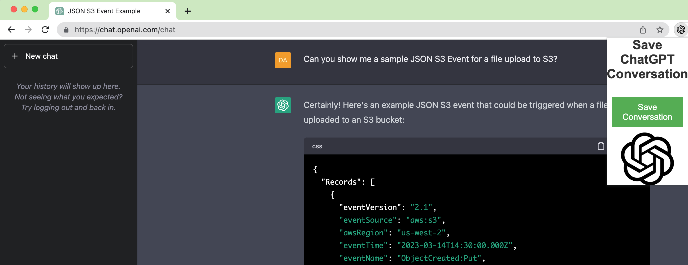

## ChatGPT Chrome Extension: Save ChatGPT Conversation to file

This is a simple Chrome extension written with me and my pair programming buddy ChatGPT. It allows you to quickly save a chat to file, making this extension a useful tool for sharing your experience offline with friends or colleagues.

## Installation

The current version of the extension is still a WIP, please use the developer mode to install:

To install the extension, follow these steps:

1.  Download the code from the GitHub repository.
2.  Open the Chrome browser and navigate to `chrome://extensions`.
3.  Enable Developer mode by clicking the toggle switch in the upper right corner.
4.  Click the "Load unpacked" button and select the directory where you downloaded the code.

## Usage

To use the extension, select a chat you wish do convert to html,  click the extension icon in the top right corner of your browser window. This will open the extension popup, where you can save the chat as html that you wish to share.

## Background
[### _Programming with ChatGPT - Human still required!_](#background)

This article is about my experiences using ChatGPT, an AI language model developed by OpenAI. As a developer, I collaborated with ChatGPT to program a Chrome extension, which turned out to be both challenging and rewarding. Through this experience, I learned a lot about working with AI language models and how powerful they can be. If you would like to see the actual chat session that created the extension, [click here](https://htmlpreview.github.io/?https://github.com/DanTanzer/save_chatgpt_chrome_extension/blob/main/theChat.html).

As a developer, I was initially skeptical of using ChatGPT, as I was worried that this AI model might take over my job or make it obsolete. However, I decided to dive in and see how it would work in practice. I wanted to test ChatGPT's ability to understand my natural language requests, as well as its ability to work with Chrome Extension APIs and programming languages such as JavaScript, HTML, and CSS. My goal was to create a simple extension that would save the ChatGPT conversation in HTML format, allowing me to share it with my friends and colleagues offline. As part of the experiment, I made as few changes to the code as possible and asked for debugging assistance whenever necessary.

During the chat session, I explained my requirements to ChatGPT and asked for its assistance. It provided me with a working sample and helped me debug the code whenever errors were identified. I was able to iterate on the code and improve it until I had a working solution. It was amazing to see this tool in action, and since then, I have been hooked.

What I Liked:

I am truly impressed by ChatGPT's capabilities. I used simple language to explain what I wanted to do, and it wrote the code in JavaScript, HTML, and CSS. I iterated through my features and asked it to pivot with new feature requests as we progressed. I have had many chats since this one and use it constantly to answer small things and expedite my work. This process of looking up small programming tasks was similar to the way I had worked with Google, except now I am getting extremely tailored answers to my questions instead of scrolling to find something similar. I find that small, concise questions work brilliantly. I wouldn't consider the requests below to be simple, but ChatGPT did not disappoint.

>How do I pass S3 variables to an ECS Task from an EventBridge?
>
>Can you show me a sample JSON S3 Event for a file upload to S3?

What I Didn't Like:

ChatGPT would sometimes completely rewrite the structure of the code in response to small changes that didn't seem necessary. I was simply asking for a small tweak, but it would restructure everything. Sometimes, it seemed to refer to different versions of the Chrome Manifest (v2 and v3), but it was super polite when I pointed it out. In another chat, I tried summarizing everything into one request, and I found it far harder to get it to finish what we started.

Conclusion:

In the end, with the help of AI, I was able to create a Chrome extension that does exactly what I set out to do, and that is amazing! However, it is important to note that humans are still required when it comes to programming with ChatGPT.  It will expedite the development process but you still need to drive. From my experience, I recommend starting small and being very iterative through the development process.

## License

This project is licensed under the terms of the MIT license. See the `LICENSE` file for more information.